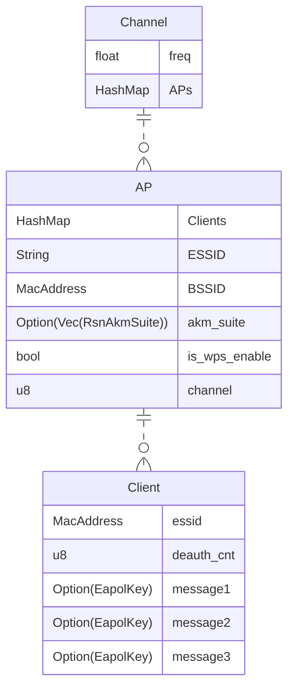

# Rustapple

Application that utilizes a wifi card to scan available frequencies for access point and associated client data. Plans to utilize this data to store keys locally for local decryption.

## Disclaimer

***Do not attack any access points you do not have authorization to attack***

## Download External Dependancies

```bash
sudo apt install libpcap-dev
```

Error if dependancy not met:
`rust-lld: error: unable to find library -lpcap`

---

## Monitor Mode

The script automatically puts the interface specified into monitor mode and then back into managed mode when done

### Manual

```bash
sudo ip link set wlan0 down
sudo iw dev wlan0 set type monitor
sudo ip link set wlan0 up
```

---

### Data Storage


